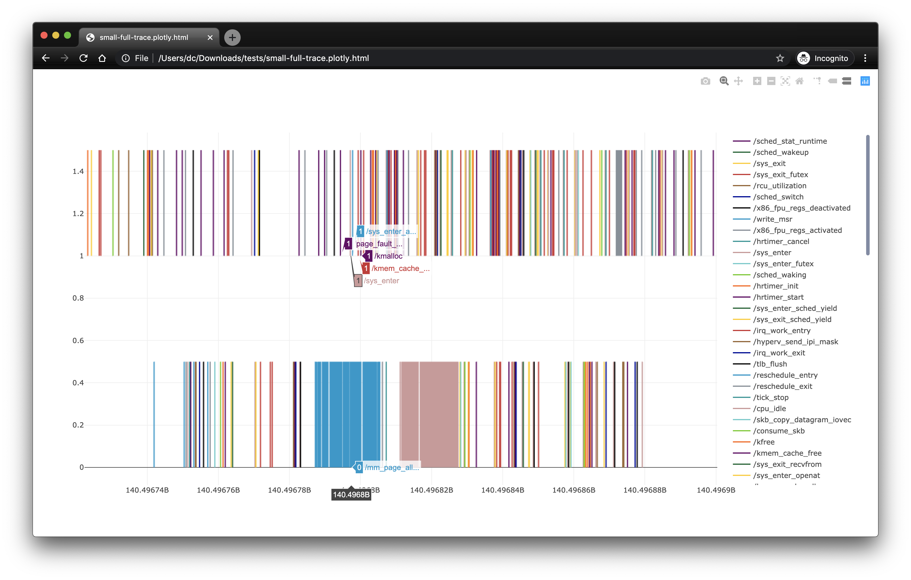
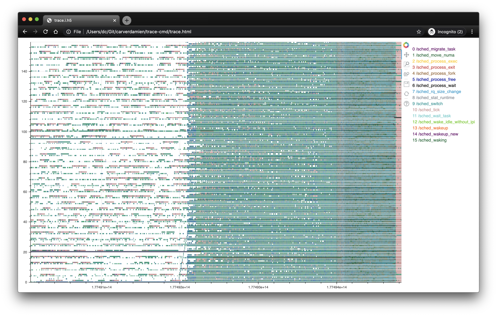

# TraceDisplay

TraceDisplay is a visualization tool for trace-cmd records.
The trace-cmd records are converted into a collection of pandas DataFrame to ease manipulation.
Rules are then specified and applied to describe how to draw and color shapes from the data.

The default rules are the following:
* For each event, a small vertical segment is drawn at `(x0,y0)` where `x0` is the timestamp at which the event occured and `y0` the cpu on which the event was recorded.
* Each segment are then colored according to the type of the event.

## Examples

All events of a `echo Hello World` on a 2-core machine rendered with [plotly](https://github.com/plotly/plotly.py):


All sched events of a `hackbench -g 250` on a 160-core machine rendered with [bokeh](https://github.com/bokeh/bokeh):


Custom rules can also be added (see [jupyter notebook example](./tests/jupyter/TestInteractiveTraceDisplay.ipynb) or [download and open it](./docs/small-sched-trace.notebook.html))

## Install

Use `docker.sh` to build a container image with TraceDisplay installed.
This script will also start a TraceDisplay container that runs a jupyter server.

If you want to install TraceDisplay on your machine follow these instructions:

```
# Install tracecmd
export PYTHON_VERS=python3
make
python setup.py install

# Install TraceDisplay
cd TraceDisplay
python setup.py install
```

## Quick Usage

```
# Record something. (e.g. all sched events)
trace-cmd record -o trace.dat -e sched echo Hello World

# Run TraceDisplay with the default rules
TraceDisplay image.html trace.dat

# open image.html
```
